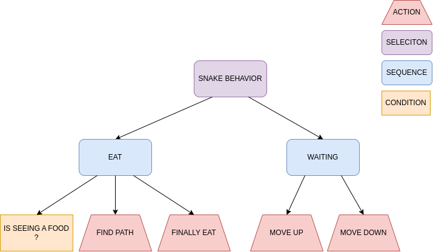
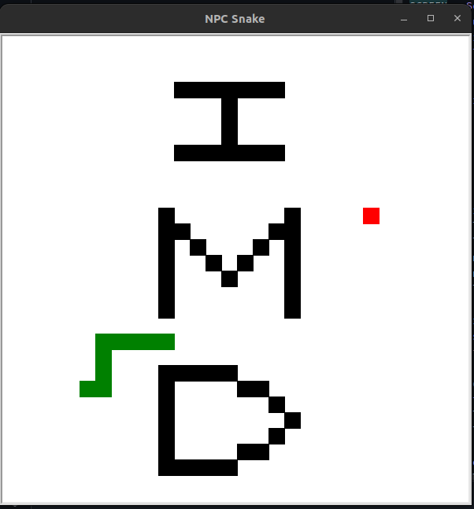

# IA PARA JOGOS: atividade avaliativa II

## Execução

Para executar este projeto, basta ter a versão do Python 3.10 instalada em sua máquina ou virtual environment.

Execute no terminal:

```bash
python main.py
```

## Explicando o projeto

Basicamente, se trata de um NPC (a snake) que é controlada por uma árvore de comportamento.
Segue abaixo a image da árvore, com todas os seus nós:



Note que, se não houver comida no mapa, o comportamento da snake será `WAITING`.
Para alterar o comportamento dela, basta clicar em algum lugar da tela, assim uma comida
irá aparecer no local clicado.

A condição `IS SEEING A FOOD?` será satisfeita, e então um caminho da snake até a comida será
calculado com o algorito de path finder `A*`.


## Imagem de exemplo

Segue uma imagem do projeto em execução:

